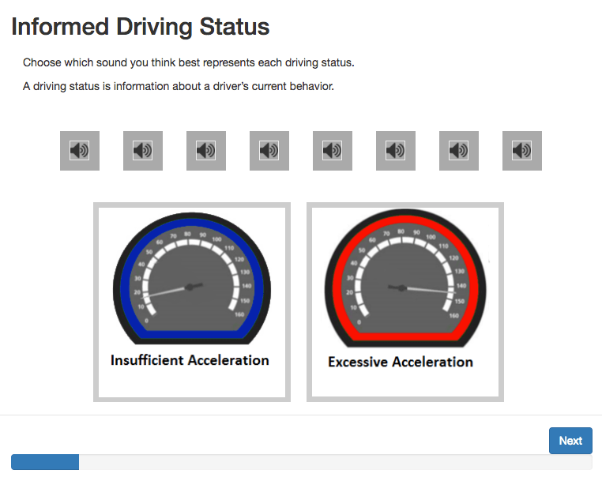

This project is the design of auditory and head-up in-vehicle interfaces to allow safer completion of a secondary task: eco-driving. Eco-driving displays are meant to shape driving behavior in a fuel-efficient manner. Current research shows that visual eco-driving interfaces can reduce fuel consumption, but hinder safe driving performance due to attention decrement and workload overflow. The design decision for a head-up and auditory display was aimed to increase fuel-efficient driving behavior while maintaining driving performance. The design of both displays was driven by data from a prior participatory design card sorting study. The study, in conjunction with these designs, lead to my senior thesis (May 2016) and a conference paper for [International Conference for Auditory Display 2017](https://smartech.gatech.edu/handle/1853/58360).

<video controls="" style="width: 100%;"><source src="https://woodburyshortridge.github.io/registerProj/video/ecoDriving.mp4" type="video/mp4"></video>

## Card sorting study

I helped develop a [card sorting program](https://github.com/WoodburyShortridge/eco-driving-testing) with Brianna Tomlinson, a PhD student in the School of Interactive Computing. The drag-and-drop program was written in javascript and enabled us to collect data as participants dragged and dropped sounds or icons onto matching driving concepts.

The data from this study helped create a design guide for auditory and visual features that match a driver's mental model of the concepts they represent.

## Sound design

I designed the sounds in Ableton live, using the Max development environment inside of Live. I created several decks of sounds following the design guidance from our study results. Some decks contained "auditory icons," which mimic everyday non-speech sounds. Others were "earcons," which are more abstract and musical sounding. The example here is an "earcon" that tells the driver to increase acceleration.

<video controls="controls" style="width: 100%; height: 3em; "><source src="https://raw.githubusercontent.com/WoodburyShortridge/registerProj/master/sounds/C4-Up.wav" type="audio/wav"></video>

## Head-up display design

Similar to the sounds, I designed each deck of icons for the head-up display following the data obtained through our study. These were designed in Illustrator, in collaboration with Yiwei Hao, a graduate industrial design student.

