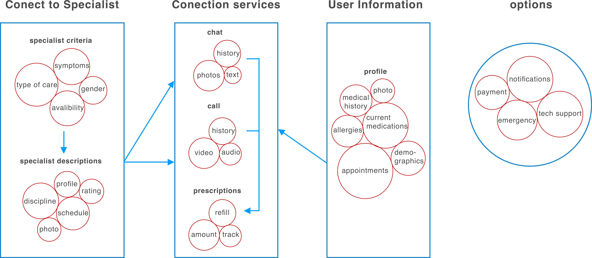
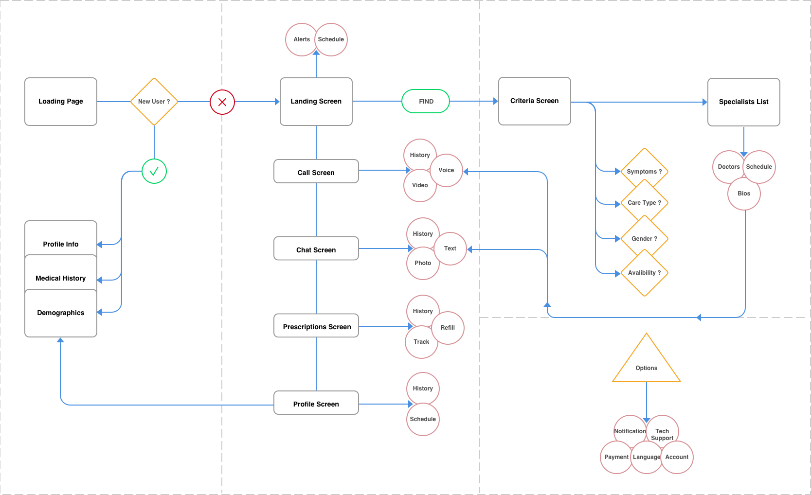

This telehealth design concept was developed as part of Tuft's computer interface design course. The design challenge for this project was to create an intuitive app lets users easily schedule and participate in virtual appointments with appropriate healthcare professionals, along with other health services such as prescription tracking. 

## Design process

The initial concept model was organized based on insights from an informal focus group.  This model presents connecting to a
specialist as a main functional grouping which leads to three main connection services: chat, call and prescriptions.

I created a UI structure diagram that reflects the conceptual model
while accounting for user needs and preferences discovered though the focus group process.
The UI structure features a wizard like flow for first time user medical information and for
connecting with the best fit specialist.

## Prototype

The final stage of this design challenge was to create a tap-able prototype for usability testing.
I designed these screens in Sketch and inVision. For the [prototype](https://woodburyshortridge.github.io/eclinic), I found I could take the React.js source from inVision and 
extended the functionality such as playing videos in the call screen and accessing the webcam.

