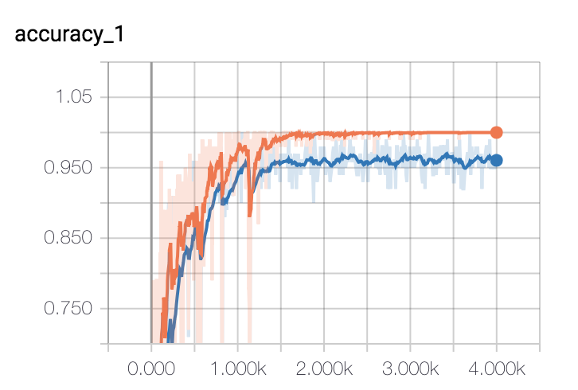
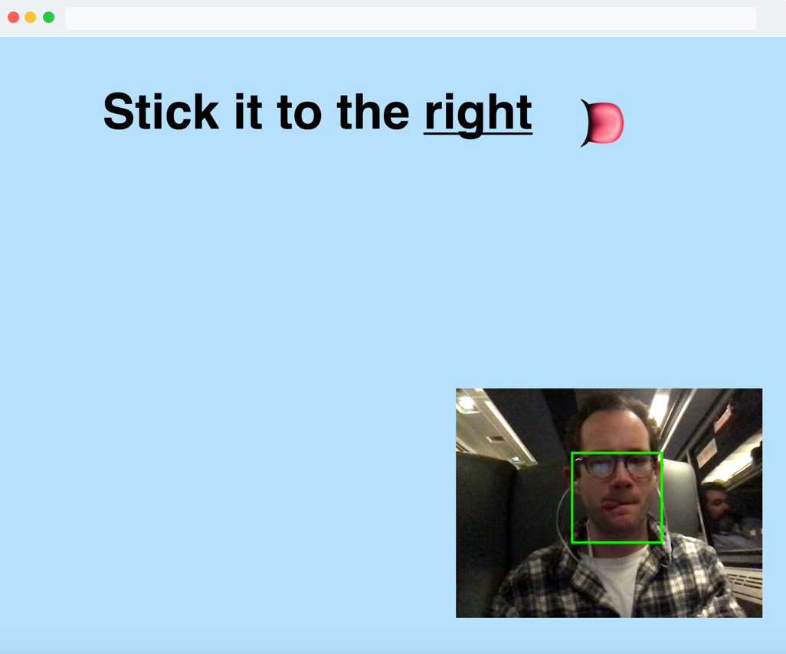
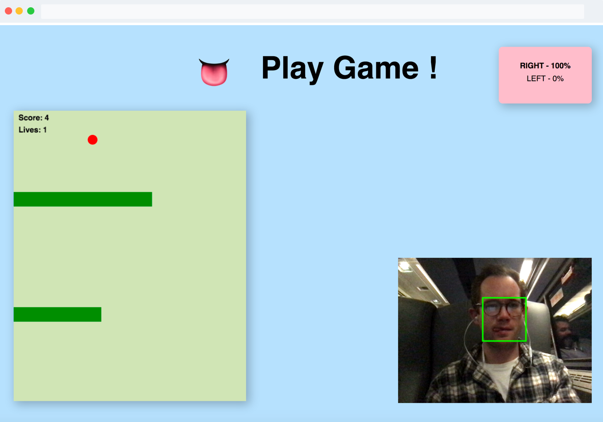

This fun project was for Prof. Jacob's OOP class focusing on non-WIMP("windows, icons, menus, pointer") user interfaces. For more information on his research, implicit brain-computer interfaces, check out the [Tufts Human-Computer Interaction Lab](http://hci.cs.tufts.edu/index.html).

## Premise

Tongue-computer interfaces are not new, there are many explorations in HCI research using various embedded sensor methods such as infrared, microphones, intraoral electrode arrays or even glossokinetic potential. And, it’s not only fun and games: tongue-computer interfaces can enable severely disabled users such as those with upper body impairments. From browsing the web to flying a drone, the tongue’s dynamic mobility offers wide potential for interaction design.

## Project

I propose a new, hardware-independent, approach to tongue-computer interaction. Using client-side JavaScript and a user’s own device webcam I developed a proof-of-concept new interaction mode with tongue movements. My application (in collaboration with CS student Jose Lemus) is a simple JavaScript game that requires LEFT and RIGHT controls. The interface leverages the newly released [JavaScript implementation of Tensorflow](https://js.tensorflow.org/) to classify the player’s tongue movements without relying on external sensors or even server-side computation.

### Game

We created a simple JavaScript clone of Flappy Bird, a “side-scroller” where the player controls a bird, attempting to fly between columns of green pipes without hitting them. Our clone takes a vertical viewpoint, meaning the avatar (a ball) progresses downwards requiring the player to move LEFT or RIGHT to avoid collisions. Per our studies, the program design exploits the features of object-oriented programming, using ECMAScript 6 classes to encapsulate graphical objects, interface controls and data needed for callback and drawing routines.

<video autoplay="" loop="" muted="">
  <source src="https://s3.amazonaws.com/tongue-computer/tonguevid.mp4" type="video/mp4">
Your browser does not support the video tag.
</video>

### Interaction design

#### Overview

With the Tensorflow.js library, the program loads our re-trained MobileNet model and a KNN classifier (see [interface.js](https://github.com/WoodburyShortridge/tongue-comp/blob/master/interface.js)). We implement the k-nearest neighbors algorithm (KNN) on top of this model. MobileNet is a small, low-latency, and low-power convolutional neural network trained on imagenet data. It is is designed to run efficiently in the browser. This allows us to rapidly train our own tongue-based classes. The classes are strengthened by user generated images it captures of people sticking their tongue to the left and right during a training phase. I used Tracking.js to find and create a bounding box around the user’s mouth. These coordinates are used to crop the video stream into focused images fed into our classifier.

#### Process

Initially, I made a simple OpenCV program in Python to collect training images (see [training/camera.py](https://github.com/WoodburyShortridge/tongue-comp/blob/master/training/camera.py)). This program listens to keypresses and captures images of right vs. left tongues and used haarcascades to crop images about the mouth. Hundreds of training images (*thanks friends and family!* ) were fed into our app by json data and added to the classifier using KNN.

To test feasibility, the app creates a canvas to which the webcam is streamed. Then, with the new model, the program classifies the each canvas frame. We found our initial methods worked ok, but not well enough to actively play a game.

Next, I re-trained our own model locally using Tensorflow’s Python library and our collection of tongue images. The training script ran 4,000 training steps. Each step grabbed 10 images at random from our LEFT RIGHT images, found their bottlenecks from the cache and fed them into the final layer to get predictions. Then, I converted this frozen model into a tensorflow.js web model. (see [/web_model](https://github.com/WoodburyShortridge/tongue-comp/tree/master/web_model)).

The new model improved our results, but we were still not satisfied with controlling the game. My final and most reliable approach was to incorporates an initial training session with the user to capture real-time images of their tongue RIGHT and LEFT and feed them into our classifier. I found the [Tracking.js](https://trackingjs.com/) library helpful to create a bounding box and crop the webcam stream around the user’s mouth in real time.

### Design

We chose to design the program to run with no keyboard or pointer interaction, tongue only. Therefore, for the training procedure we depend on animations and sound cues to help guide and give contextual awareness to the flow. Once trained, the user can also interact with dialogues such as "restart" with tongue gestures.

<b>Training:</b>

<b>Game Play:</b>

Please give tongue-computer interaction a [try in your browser](https://s3.amazonaws.com/tongue-computer/index.html). *<b>Note:</b> it is most successful in well-lighted environments*. The next phase of this exploration is to build a Chrome plug-in to control the web with your tongue - please [contact me](/about) for contributions.
