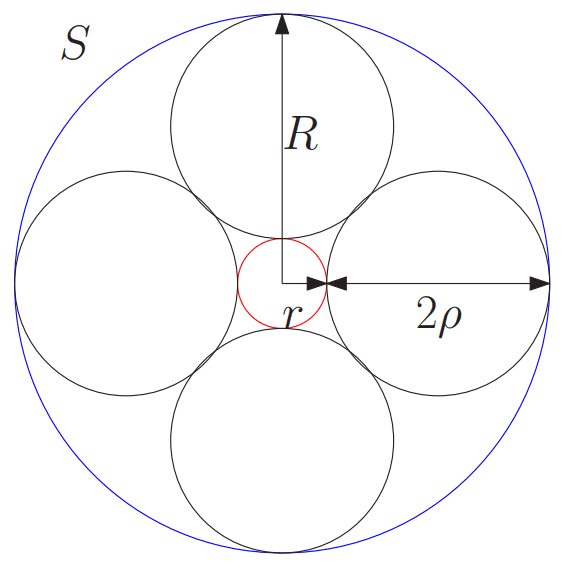

## what is this?
While exploring actionscript3 I found some Steiner Chain geometry written by [Andre Michelle](http://andre-michelle.com).

Steiner Chain is a series of infinite possible number of circles where each circle is tangent to two other non-intersecting circles. Jakob Steiner defined the chain:

> If at least one closed Steiner chain of n circles exists for two given circles α and β, then there is an infinite number of closed Steiner chains of n circles; and any circle tangent to α and β in the same way is a member of such a chain.

Geometric theorems that result in an infinite number of objects always lured my design interest. Not only did I want to animate the chain, I could not resist attempting to make it generate tones, a geometric synthesizer. 

I started with a simple sine wave. The phase of the wave was set to circle's starting position divided by sampling rate (44100) * 2 pi. To create a tone I used the sine function of this phase times the circle radius and speed.  Mapping the circle radius to frequency created a sequencing or arpeggio like effect - as the radius changes when the circles rolls around the annulus, the frequency changes accordingly in steps. Multiplying this times speed creates a transposing effect - as the speed increases, the whole sequence goes up in frequency.

Initially, I was not satisfied by ActionScript3's tone generation because it created a popping noise when changing frequency. The pop is because the phase position jumps when AS3 recreates the sine wave from a starting position at the origin. I noticed the sequenced popping sounded like an infrasonic pulse wave so I wondered if I could generate tones with periodic pops above 20hz? I was able to recreate the glitchy pops with not only phase changes, but also volume and pan. Therefore, I mapped volume to X and pan to Y coordinate of the circle. This creates interesting overtones when added to the sine wave, making the synth sound more “synthy”.

Because the pulse wave frequency had a very large range, I was able to create a fold-over effect when the circles gain speed and quantity - a circuit-bending type sound as the waves fold over into the next periodic cycle. This temporal aliasing is analogous to the [wagon-wheel](https://en.wikipedia.org/wiki/Wagon-wheel_effect) optical illusion seen when the circles get so fast they appear to stand still or move backwards.

The purpose of this synthesiser is not play-ablity, in fact it is quite difficult to create deliberate sounds. Instead I am curious to almost the reverse of a music visualizer found on iTunes or Windows Media Player. That is, generating abstract sound textures through sonification of geometric animations. My mappings of sound to visual parameters was largely inspired by psychology studies finding cross-modal correspondences by measuring response time for classifying concurrently presented auditory and visual stimuli: 

[Effects of Spatial Congruity on Audio-Visual Multimodal Integration](https://www.mitpressjournals.org/doi/abs/10.1162/0898929054985383) 
[Natural cross-modal mappings between visual and auditory features](https://www.ncbi.nlm.nih.gov/pmc/articles/PMC2920420/)

### Instructions

Enable Flash and click or focus the canvas below to start. Use the up/down arrow keys to change the infinite number of circles & frequency. Left/right to adjust speed & sequencing.

        <strong>WARNING</strong> Due to hacky tone generation, this demo is very loud. Please adjust volume acordingly.

			<object classid="clsid:d27cdb6e-ae6d-11cf-96b8-444553540000" width="600" height="600" id="synthProj" align="middle">
				<param name="movie" value="https://s3.amazonaws.com/woodburyshortridge/api/v1/synthProj/synthProj.swf" />
				<param name="quality" value="high" />
				<param name="bgcolor" value="#000000" />
				<param name="play" value="true" />
				<param name="loop" value="true" />
				<param name="wmode" value="window" />
				<param name="scale" value="showall" />
				<param name="menu" value="true" />
				<param name="devicefont" value="false" />
				<param name="salign" value="" />
				<param name="allowScriptAccess" value="sameDomain" />
				<!--[if !IE]>-->
				<object type="application/x-shockwave-flash" data="https://s3.amazonaws.com/woodburyshortridge/api/v1/synthProj/synthProj.swf" width="600" height="600">
					<param name="movie" value="https://s3.amazonaws.com/woodburyshortridge/api/v1/synthProj/synthProj.swf" />
					<param name="quality" value="high" />
					<param name="bgcolor" value="#000000" />
					<param name="play" value="true" />
					<param name="loop" value="true" />
					<param name="wmode" value="window" />
					<param name="scale" value="showall" />
					<param name="menu" value="true" />
					<param name="devicefont" value="false" />
					<param name="salign" value="" />
					<param name="allowScriptAccess" value="sameDomain" />
					<!--<![endif]-->
					
					<!--[if !IE]>-->
				</object>
				<!--<![endif]-->
			</object>
		

