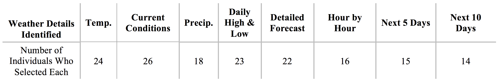
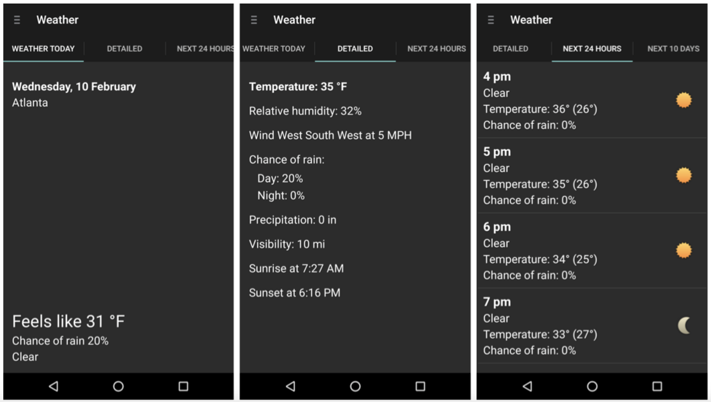
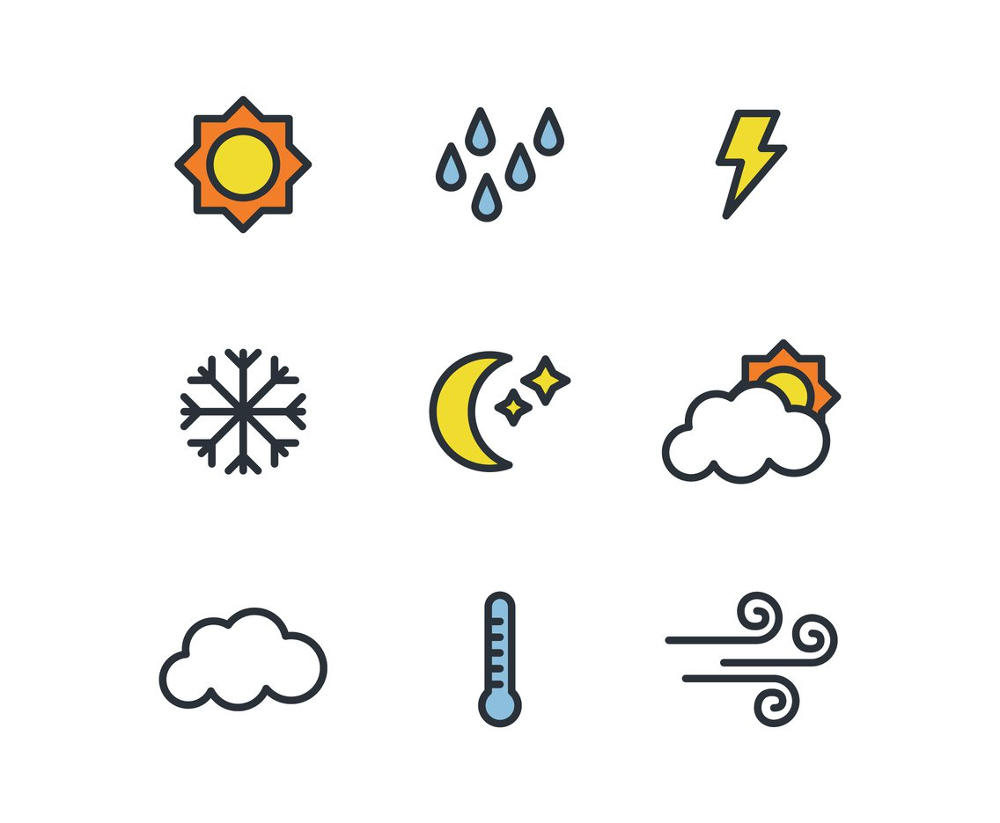
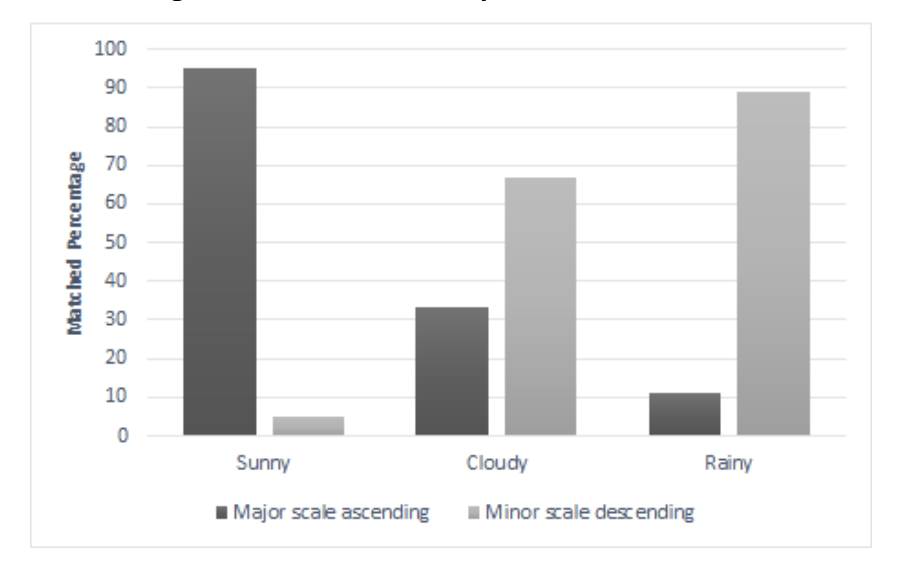

*Georgia Tech, Sonification research project, [International Conference on Human-Computer Interaction with Mobile Devices 2016](https://www.semanticscholar.org/paper/Talkin-about-the-weather-incorporating-TalkBack-fu-Tomlinson-Schuett/7d6a0e0d1348c5d4b9ff54940fbbb8b1be7b8b32)*

This project not only highlights the power of multimodal interface design for diverse users, it also serves to show how designing for edge cases elevates the experience for all. Along with my team at the Georgia Tech Sonification lab, I developed an [Android weather app](https://play.google.com/store/apps/details?id=com.sonification.accessibleweather) with a talk-back UI and especially enhanced the user experience for the visually impaired by creating earcons that provide the ‘glanceable’ function of visual weather icons to screen reader dependent users, resulting in a conference paper for [MobileHCI 2016](https://www.semanticscholar.org/paper/Talkin-about-the-weather-incorporating-TalkBack-fu-Tomlinson-Schuett/7d6a0e0d1348c5d4b9ff54940fbbb8b1be7b8b32).

<iframe width="560" height="315" src="https://www.youtube.com/embed/EzE8g3A-D8U" frameborder="0" allow="autoplay; encrypted-media" allowfullscreen></iframe>

## Information Architecture

As ubiquitous as weather is in our daily lives, individuals with vision impairments endure poorly designed user experiences when attempting to check the weather on their mobile devices. This is primarily caused by a mismatch between the visually based information layout on screen and the order in which a screen reader, such as TalkBack or VoiceOver, presents the information to users with visual impairments. 

While sighted users can visually jump around the screen looking for the most salient information – usually in the form of larger text or an icon – a user reliant on the screen reader is forced to consume the information in a sequential order. Often this results in additional time or steps wasted to get to the intended information, such as current temperature, overall conditions, or the upcoming forecast. While this lack of efficiency and flexibility often results in a poorer user experience, in some cases weather information is completely absent or inaccessible the user. Therefore, information architecture (IA) was key to designing a great user experience for our assertive tech user group.

### Methods

We preformed an information needs analysis to determine what hierarchies and flows would best serve our intended users. This was accomplished through users completing an online questionnaire and providing additional insight they thought was relevant through forum posts and emails. Part of designing a weather app that worked smoothly with TalkBack from the ground up meant uncovering what information was important to users, learning how they felt about their current weather apps, and discovering how they experienced the app through TalkBack.

Through self the report measures we were able to establish best information grouping and hierarchies. Then, using the information we gathered from users and the comparisons from a survey of existing apps, we created the first version of the Accessible Weather App, pulling data from WeatherUnderground’s API. 

The interaction used special TalkBack enabled gestures. If a user clicks anywhere on the background of the
main screen (and also the details tab), it is designed to read all of the information starting with the date. If a user doesn’t want to hear the entire overview, she might swipe right to left, which would start reading the current conditions and move up throughout the page with each subsequent swipe. Swiping left to right will start at the menu drawer then move through the tabs at the top
(“Weather today,” “Detailed,” “Next 24 hours,” “Next 10
days”). You can also navigate between tabs by
performing a two-finger drag in either direction. From the menu drawer (activated with a two-finger tap) a user may perform a city lookup, or change settings such as what information to be read in push notifications.

## Auditory weather icon design

In addition to accessible gestures and text-to-speech, I was primarily interested in in enhancing the user experience for visually impaired users by creating auditory weather icons that provide a function similar to that of visual weather icons. Visual icons are used to quickly convey information to the user at a glance. I sought to create that ‘glanceable’ effect in an
accessible way for screen reader dependent users by
including sonifications of the weather conditions.
Sonifications are intentional sounds that use non-speech
audio to convey information or data to listeners.

 

I wanted the sounds we employed to become
easily recognizable for listeners but also flexible enough to represent all weather conditions with a consistent design language. Therefore, I began by evaluating a variety of acoustic parameters based on both synthetic and everyday real-world sounds through a soundsorting task. This excursive helped determine which acoustic parameters would work best for conveying information about each weather condition, and what musical scales are best matched to these concepts.

 

Using acoustic textures discover in our research, I designed the sounds in Ableton live. Using the Max development environment inside of Live, I build both modular and granular synthesizers for each wether type, producing ecologically associated sound textures. With these synthetic instruments I wrote 2-3 second musical motifs. Here is an example of "Sunny" vs. "Rainy".

#### Sunny
<video controls="controls" style="width: 100%; height: 3em; "><source src="https://s3.amazonaws.com/woodburyshortridge/api/v1/accessible-weather/sun.wav" type="audio/wav"></video>

#### Rainy
<video controls="controls" style="width: 100%; height: 3em; "><source src="https://s3.amazonaws.com/woodburyshortridge/api/v1/accessible-weather/rain.wav"></video>

For more examples, please see my [GitHub repository](https://github.com/WoodburyShortridge/mobileA11yWeather).

### Implementation

Right after the app opens, the auditory weather icon play, indicating the current conditions, before any text-to-speech is read aloud. This creates a unique experience allowing you to take a 'glance' at the weather. Through the Android development, we were also able to kick off auditory icons with push notifications. Imagine you are sitting at work and you get a push notification about a thunderstorm approaching. Now, with auditory icons, you are able to interpret all that information without ever taking your phone out of your pocket. 

This new found feature demonstrates how designing for edge cases elevates the experience for all. 

Try the *Accessible Weather* app on [Google Play](https://play.google.com/store/apps/details?id=com.sonification.accessibleweather), and thanks to continued work by Georgia Tech's Kamen Tsvetkov [coming soon on iOS](https://github.com/saqlaingolandaz/Accessible-Weather-App-iOS-).

