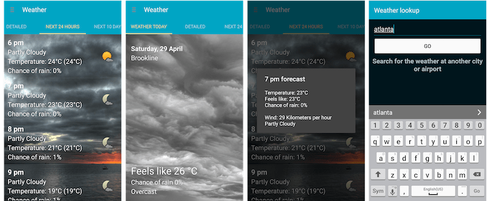

Our team at the Georgia Tech Sonification developed an [Android weather app](https://play.google.com/store/apps/details?id=com.sonification.accessibleweather) with a talk-back UI and enhanced the user experience for the visually impaired by creating earcons that provide the ‘glanceable’ function of visual weather icons to screen reader dependent users, resulting in a conference paper for [MobileHCI 2016](https://www.semanticscholar.org/paper/Talkin-about-the-weather-incorporating-TalkBack-fu-Tomlinson-Schuett/7d6a0e0d1348c5d4b9ff54940fbbb8b1be7b8b32).

<iframe width="560" height="315" src="https://www.youtube.com/embed/EzE8g3A-D8U" frameborder="0" allow="autoplay; encrypted-media" allowfullscreen></iframe>

#
## Information Architecture

As ubiquitous as weather is in our daily lives, individuals with vision impairments endure poorly designed user experiences when attempting to check the weather on their mobile devices. This is primarily caused by a mismatch between the visually based information layout on screen and the order in which a screen reader, such as TalkBack or VoiceOver, presents the information to users with visual impairments. Therefore, IA was key to designing a great user experience for blind users.

We preformed an information needs analysis to determine what order would best serve our intended users. This was accomplished through users completing an online questionnaire and providing additional insight they thought was relevant through forum posts and emails. Part of designing a weather app that worked smoothly with TalkBack from the ground up meant uncovering what information was important to users, learning how they felt about their current weather apps, and discovering how they experienced the app through TalkBack.

## Sound design

Additionally, any image or icon included on the screen presents no information to the user if they are not able to see it. Therefore, we also included a set of [auditory weather icons](https://github.com/WoodburyShortridge/mobileA11yWeather/tree/master/earcons) which use sound, rather than visuals, to convey current weather conditions to users in a fast and pleasant way.

I designed the sounds in Ableton live, using the Max development environment inside of Live. These were musical in nature and I also used ecologically associated sound textures. Here is an example of "Sunny" vs. "Rainy".

#### Sunny
<video controls="controls" style="width: 100%; height: 3em; "><source src="https://raw.githubusercontent.com/WoodburyShortridge/mobileA11yWeather/master/earcons/Sun.wav" type="audio/wav"></video>

#### Rainy
<video controls="controls" style="width: 100%; height: 3em; "><source src="https://raw.githubusercontent.com/WoodburyShortridge/mobileA11yWeather/master/earcons/Rain.wav"></video>
