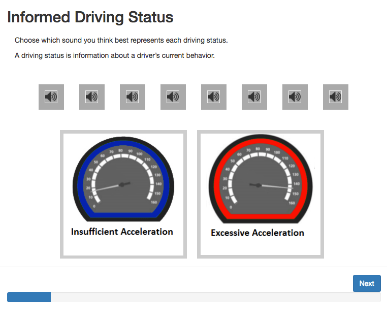
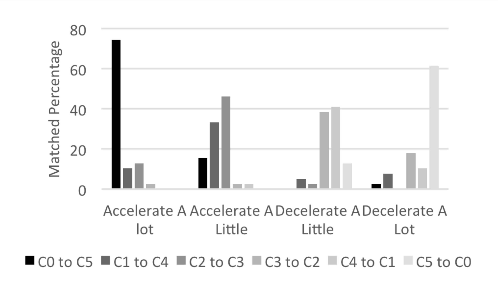
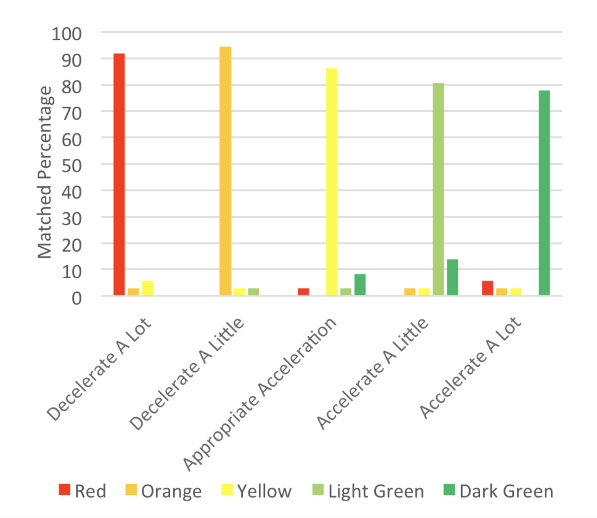
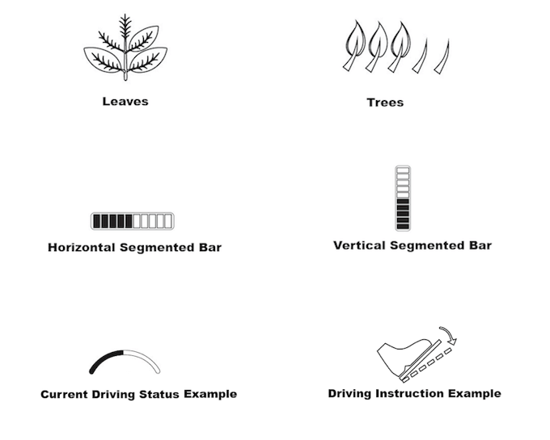

This project, out of the Georgia Tech Sonification Lab, is the design of auditory and head-up in-vehicle interfaces to allow safer completion of a secondary task: eco-driving. Eco-driving displays are meant to shape driving behavior in a fuel-efficient manner. Current research shows that visual eco-driving interfaces can reduce fuel consumption, but hinder safe driving performance due to attention decrement and workload overflow. The design decision for a head-up and auditory display was aimed to increase fuel-efficient driving behavior while maintaining driving performance and safety. 

The design of both interfaces was driven by data from several participatory design card sorting studies. The research studies, in conjunction with these designs, lead to my senior thesis (May 2016) and a conference paper for [International Conference for Auditory Display 2017](https://smartech.gatech.edu/handle/1853/58360).

## Background

Theoretical background was heavily based Wickens’ [Multiple Resource Theory](http://journals.sagepub.com/doi/abs/10.1518/001872008X288394) (MRT). Wickens proposes that the limited capacity of working memory creates a bottleneck when resources are exhausted. This bottleneck leads to a reduction in working memory resources for a primary task, when a secondary task of the same modality is introduced. This helped me arrive at the design decision for a head-up and auditory display which aimed to increase fuel-efficient driving behavior while maintaining driving performance and safety.

## Card sorting study

I helped develop a [card sorting program](https://github.com/WoodburyShortridge/eco-driving-testing) with Brianna Tomlinson, a PhD student in the School of Interactive Computing. The drag-and-drop program was written in JavaScript and enabled us to collect data as participants dragged and dropped sounds or icons onto driving concepts.

The data from this study helped create a design guide tool for auditory textures and visual features that match a driver's mental model for the abstract concepts they represent. We were able to find patterns and preferences in the results that aid both auditory and visual design.

Results from the participatory design exploration provided insights into intuitive mappings and polarities. For example, this chart shows how various triads, played on a piano, were matched with the concept of acceleration. We found patterns in other sound parameters such as attack, sustain, decay and release (ADSR), frequency filters, reverberation, register, range, tempo, and scales. These patterns uncovered relationships between acoustic parameters and perceptions of constructs.

Likewise, data from the visual study gave valuable conceptual mappings of graphical elements such as color, orientation, and geometry. This simple example shows the strong pattern found in color.

## Sound design

I designed the sounds in Ableton live, using the Max development environment inside of Live to create synthesizers that incorporated acoustic parameters derived from my research. I created several decks of sounds following the design guidance from our study results. Each deck followed a theme such as "auditory icons" which mimic everyday non-speech sounds. Others were "earcons" which are more abstract and musical sounding. Or even a "speech" deck using computer generated voices that matched acoustic parameters like ADSR and frequency. The example here is an "earcon" that tells the driver to increase acceleration.

<video controls="controls" style="width: 100%; height: 3em; "><source src="https://s3.amazonaws.com/woodburyshortridge/api/v1/eco-driving/C4-Up.wav" type="audio/wav"></video>

## Head-up display design

Similar to the sounds, I designed each deck of icons for the head-up display following the data obtained through our study. These were designed in Illustrator, in collaboration with Yiwei Hao, a graduate industrial design student at Georgia Tech.

## Simulator

These multi-modal interface prototypes were tested in a pilot driving simulator and eye-tracking study. Primary measures include eco-driving behavior, eye behavior, subjective workload, and driving performance. For more information regarding this ongoing research please <a href="mailto:whshortridge@gmail.com">contact me<a>.

<video controls="" style="width: 100%;"><source src="https://s3.amazonaws.com/woodburyshortridge/api/v1/eco-driving/ecoDriving.mp4" type="video/mp4"></video>

### Human-centric vs. System-centric Displays

A consistent theme throughout this research was human-centric vs. system-centric displays. Human-centric approaches informed drivers using human parameters, how to engage or change driving their behavior. Whereas system-centric displays describe the fuel economy or state of the system. We observed interesting moderator effects in that the opposite polarity of design elements was found for the same driving concepts across display type. In addition, our survey results pointed to preferences for displays that inform, rather than instruct, the driver. This supports research showing displays presenting more persuasive information are perceived as less useful and more difficult.
