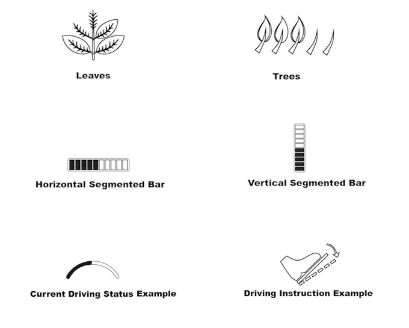

*Georgia Tech, Sonification Lab senior thesis project, [International Conference for Auditory Display 2017](https://smartech.gatech.edu/handle/1853/58360)*

This project demonstrates the power of multi-modal displays in encouraging fuel-efficient driving behavior (“eco driving”). These “eco driving” displays are comprised of both auditory and visual, head-up “interfaces” that work in harmony to provide behavioral feedback to the driver. Auditory displays provide intuitive, sonified cues (you’re driving too fast!) that I designed based on data from previous research and a unique card sorting experiment that tests drivers’ mental models of sound and driving behavior. The head-up display similarly nudges the driver toward more fuel-efficient behaviour using visual icons that the driver sees projected onto the windshield of the car. I designed these visual icons using data from user testing matching visual elements with instructional and informational cues.

## Background

Traditional visual-only eco-driving displays hinder safe driving because the driver is distracted and overloaded while trying to perform a “secondary” driving task (i.e., attention to in-vehicle interfaces). In collaboration with my team at the Sonification Lab at Georgia Tech, I set out to re-imagine these displays for a more seamless, safer eco-driving experience.

I was heavily influenced and inspired by Wickens’ [Multiple Resource Theory](http://journals.sagepub.com/doi/abs/10.1518/001872008X288394) (MRT). Wickens proposes that the limited capacity of working memory creates a bottleneck when resources are exhausted. This bottleneck leads to a reduction in working memory resources for a primary task, when a secondary task of the same modality is introduced. With this in mind, I decided to design a multi-modal interface based on visual, head-up and auditory cues that encourage fuel-efficient driving behavior without compromising the driver’s safety. 

## Card sorting study

My team (shoutout to Brianna Tomlinson, PhD, School of Interactive Computing) and I developed a [card sorting program](https://github.com/WoodburyShortridge/eco-driving-testing) for our user testing. I wrote the drag-and-drop program in JavaScript, which allowed us to collect data as participants dragged and dropped sounds or icons onto driving concepts. The patterns and preferences we observed in these experiments  informed our design of auditory and visual in-vehicle displays.

We used the data from this study to create a design guide for understanding how drivers intuitively match sound textures and visual elements with  certain driving  concepts.

Results from these participatory design explorations also provided insights into users’ intuitive mappings and polarities. For example, this chart shows how various triads, played on a piano, were matched with the concept of acceleration. We found patterns in other sound parameters such as attack, sustain, decay and release (ADSR), frequency filters, reverberation, register, range, tempo, and scales. These patterns uncovered relationships between acoustic parameters and perceptions of constructs.

Likewise, data from the visual study gave valuable conceptual mappings of graphical elements such as color, orientation, and geometry. This simple example shows the strong pattern found in color.

## Sound design

I designed the sounds in Ableton live, using the Max development environment inside of Live to create synthesizers that incorporated acoustic parameters derived from my research. I created several decks of sounds following the design guidance from our study results. Each deck followed a theme such as:
- "auditory icons" mimicking everyday non-speech sounds"earcons" which are more abstract and musical sounding 
- "earcons" which are more abstract and musical sounding 
- "speech" sounds using computer-generated voices that match acoustic parameters like ADSR and frequency

The example here is an "earcon" that tells the driver to increase acceleration.

<video controls="controls" style="width: 100%; height: 3em; "><source src="https://s3.amazonaws.com/woodburyshortridge/api/v1/eco-driving/C4-Up.wav" type="audio/wav"></video>

## Head-up display design

Similar to the sounds, I designed each deck of visual icons for the head-up display using data from our card sorting study. In collaboration with my team (shoutout to Yiwei Hao, MS industrial design), I designed the visual icons in Adobe Illustrator.

## Simulator

We tested our multi-modal interface prototypes in a pilot driving simulator and eye-tracking study. In this study, we measured eco-driving behavior, eye behavior, subjective workload, and driving performance. For more information regarding this ongoing research please <a href="mailto:whshortridge@gmail.com">contact me<a>.

<video controls="" style="width: 100%;"><source src="https://s3.amazonaws.com/woodburyshortridge/api/v1/eco-driving/ecoDriving.mp4" type="video/mp4"></video>

### Exploration of Human vs. System-centric Displays

Throughout this research project, I grappled with the tension between “human-centric” and “system-centric” displays. Human-centric displays inform drivers using human parameters, for example, instructing the driver how to engage or change certain behavior. On the other hand, system-centric displays describe the fuel economy or state of the system. In our testing, we found an interesting “moderator effect” where cues meant to encourage the same behaviour matched with different auditory and visual icons depending on whether the driver was using a human- or system-centric display. For example, in a human-centric display, instructing the driver to slow down was paired with the opposite sound/icon pair than a system-centric display informing the driver that their driving was not fuel-efficient (because of speed).

We also found that users preferred displays that informed, rather than instructed them. This finding supports research showing that users perceive displays presenting persuasive information as less useful and more difficult.
