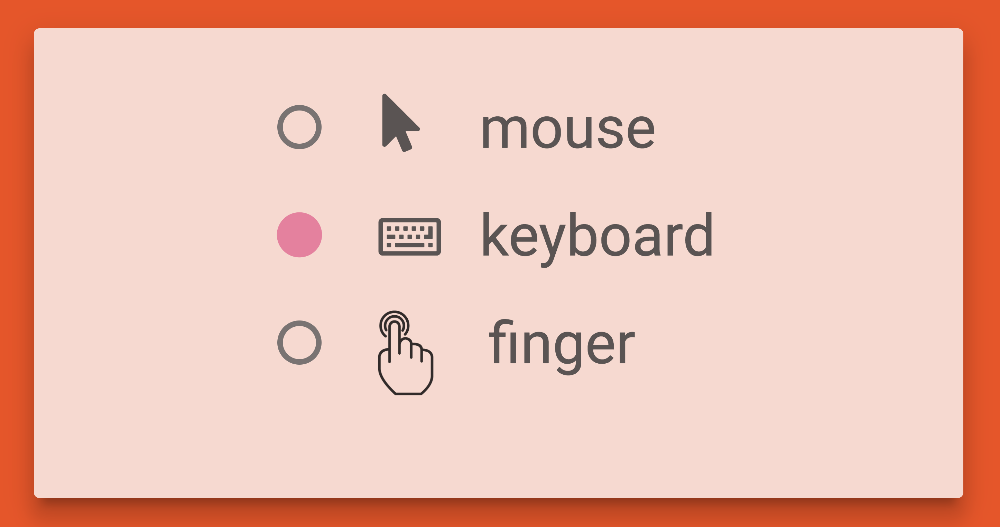

# Premise

In the summer of 2017 I had the wonderful privilege supervising the talented Matthew Shiffern's internship at the [Institute for Human Centered Design](https://humancentereddesign.org/). Matthew, who is completely blind, introduced me to the accessible gaming community. I was stuck by the lack of interactive play in the primarily text-based games available to blind individuals. 

# Building

Fast forward a month to a work trip to Washington, DC. I was sitting on a SouthWest plane wrapping up my presentation when the internet went down. Luckily, I had both an idea and [P5.js](https://p5js.org/), the JavaScript version of Processing, downloaded. I planed to build an interactive audio game for Matthew through a new, sonified, take on pong. 

With p5.js + Web Audio API I created two audio streams, hard panned to the left and right. These audio streams are designed to display the ball and paddle movement. On the left stream, I instantiated a triangle wave that is mapped to the X-axis movement of the paddle. As the paddle X position of the paddle increased, the frequency of the triangle wave increased. 

<video controls="controls" style="width: 100%; height: 3em; "><source src="https://s3.amazonaws.com/woodburyshortridge/api/v1/sonified-pong/paddle.mp3" type="audio/mp3"></video>

Then, on the right panned auditory stream, I created a square wave to represent the movement of the ball in 2D space. Similar to the paddle, the X position of the ball is mapped to the square wave frequency. For the Y position of the ball I created a sine wave modulator so that as the ball gets closer to the bottom, the modulation gets more intense.

<video controls="controls" style="width: 100%; height: 3em; "><source src="https://s3.amazonaws.com/woodburyshortridge/api/v1/sonified-pong/ball.mp3" type="audio/mp3"></video>

To display the ball bouncing of the boundaries or paddle, I created an auditory cue with a ping-pong delayed tone. Again, the frequecy of this tone is mapped to the Y position of the collision as to provide context: a bounce off the paddle is a low freq, off the wall is higher, and off the ceiling is highest.

<video controls="controls" style="width: 100%; height: 3em; "><source src="https://s3.amazonaws.com/woodburyshortridge/api/v1/sonified-pong/bounce.mp3" type="audio/mp3"></video>

Here is a video of Matthew Shifrin ( creator of [Lego for the Blind](http://legofortheblind.com/) ) demoing the game. 

<iframe width="560" height="315" src="https://www.youtube.com/embed/lpvNyfr51zI" frameborder="0" allow="autoplay; encrypted-media" allowfullscreen></iframe>

# Design

I chose the auditory textures to give signifies and contextual awareness of the game state. Matthew is able to understand the ball location in the context of the frame by listening to the frequency changes, modulation, and bouncing cues. While simultaiously tracking his paddle movements through frequecy, he is able to block the ball at the right time. Along with hard pans, the unique sound textures of the two wave forms help with differentiating the audio stream.

To make the interactions accessible to keyboard dependent users, I made options in the UI for different JavaScript listeners such as arrow keys or even touch.

Assistive tech such as Matthew's JAWS screen reader can not be used concurently with game play because these override key functions and often speak over the auditory display. Therefore I used text-to-speech in JavaScript to make a fun score keeper who makes announcements.  

<video controls="controls" style="width: 100%; height: 3em; "><source src="https://s3.amazonaws.com/woodburyshortridge/api/v1/sonified-pong/score.mp3" type="audio/mp3"></video>

## Extensions

This was a fun design experiment and I was quite amazed by the play-ability for Matthew and other blind gamers. I've recently been wondering if this proof-of-concept can be applied to wayfinding withing a constrained environment. That is, make the "ball" an actual person in an environment and display a stream to heighten spacial perception. Matthew described a perfect problem space: he enjoys swimming, but can not swim independently as he must bring a friend to literally wack him on the head before he crashes into the walls. 

This year I am sponsoring and leading a group of Tufts University senior capstone students to attack this problem. We are currently prototyping and user-testing an underwater ultrasonic sensor system with various auditory and haptic feeback streams to facilitate independent swimming for the visually impaired community.

