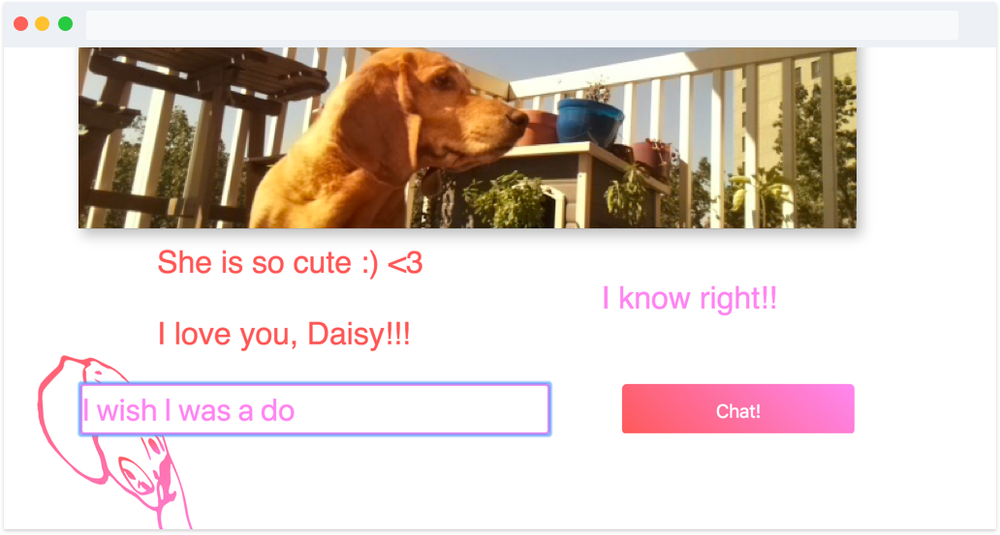

*[www.D4isy.com](http://d4isy.com)*

## Premise

My wife underwent an intensive surgery a year ago with a long in-patient recovery and, despite my attempts, the hospital would not allow our dog Daisy to come visit. This spurred an evolving Raspberry Pi project, *Daisy Cam*, where I have been exploring edge computing, convolutional neural networks, animal-computer interaction, and most importantly virtually connecting the world with Daisy the dog.

## Camera Stream

Unfortunately, Raspi(Raspberry Pi) live stream solutions are subpar, most are pretty slow, low quality, and have a huge video delay since providers such as VLC re-stream a stream of Raspvid. My solution was to start with [avconv](https://libav.org/documentation/avconv.html) to convert a pipe of Raspivid to mpeg in real-time. Then, with a node.js websocket server, I opened up a data stream to connected clients.

On the client side, I implemented the amazing [jsMPEG library](https://github.com/phoboslab/jsmpeg) to decode the MPEG websocket stream in a browser and paint to HTML5's Canvas2D. The pipeline is able to decode 720p Video at 30fps on any browser and even mobile.

## Daisy Detection

The Raspi live stream was great, but catching Daisy on camera was a challenge for my wife (still recovering in hospital) and other Daisy subscribers. My next task: create a Daisy detector. This required a dive into the world of convolutional neural networks(CNN) where I turned to Tensorflow's object detection API:

### Data

To begin I had to not only source a bunch of Daisy photos, but also make annotation files and covert all of these to the TFRecord file format. I was able to aid the process by grabbing some 200 or so annotated photos of Basset Hounds from the [Oxford-IIIT Pet Dataset](http://www.robots.ox.ac.uk/~vgg/data/pets/). Next, I hand annotated another hundred photos we had of Daisy by drawing bounding boxes. Thanks to the Python [LabelImg tool](https://github.com/tzutalin/labelImg), annotations were saved as XML files in the PASCAL VOC format which I easily [converted to TFRecords](https://github.com/WoodburyShortridge/daisyCam/blob/master/tensorflow/make_tfrecord.py).

### Training

To train my model, I fired up a Google cloud server with decent GPU. I tweaked Tensorflow's sample [ssd_mobilenet_v1_pets.config](https://github.com/tensorflow/models/blob/master/research/object_detection/samples/configs/ssd_mobilenet_v1_pets.config) for my dataset, an SSD with Mobilenet v1, configured for Oxford-IIIT Pets Dataset. I used a pre-trained model checkpoint, ssd_mobilenet_v1_coco, to help bootstrap the training sessions. This is a small, low-latency, and low-power CNN that is designed to run efficiently on mobile, and hopefully my raspi. 

The training session lasted about 2 hours, over 60k steps, at which point my mean average precision hit about 0.85. Now I could use the exported Tensorflow graph proto for classifying daisy in photo streams!

## App

Building the app meant pulling all these pieces together on the Raspi's 1.2GHz Arm processor and 1GB of RAM. I already had a node.js websocket server piping the MPEG stream. Getting Tensorflow and OpenCV to run on the Raspi was not a walk in the park. It required creating a memory swap partition on a large SD card to build from source. After a successful custom build, the node server could now spawn [my Python program](https://github.com/WoodburyShortridge/daisyCam/blob/master/tensorflow/daisy_detection/daisy_detection_main.py) that classified each grabbed frame with a score for *Daisy* or *Not Daisy* using my frozen inference graph. 

To alert all the Daisy enthusiasts, I added a [node.js emailer](https://github.com/WoodburyShortridge/daisyCam/blob/master/email.js) that sends out batch emails to clients that join the mailing list. The emails are triggered when the Python program finds a frame with a 0.9 or higher *Daisy* score and saves these frames to a local directory. Then, in the same node runtime, I launched an express REST api to serve requests for captured images. I configured an NGINX reverse proxy server to forward requests to the API, client app, and websocket streams.

### Design

The front-end is build with the React.js library. Along with the Canvas2D live stream, I designed an interactive photo gallery of all the machine-taken photos. To date, the model has taken over 500 photos with no false alarms!

<video controls autoplay loop>
  <source src="https://s3.amazonaws.com/woodburyshortridge/api/v1/daisy-cam/galley_movie.mp4" type="video/mp4">
Your browser does not support the video tag.
</video>

And for some social interaction, Daisy's subscribers can chat to each other with a messenger component I build on-top of socket.io.

See Daisy live and explore the gallery @ [www.D4isy.com](http://d4isy.com) and don't forget to join the email alerts!

## Animal-computer interaction

I've always been intrigued by the possibilities of animal-computer interaction. Back when I did research at Georgia Tech's Sonification Lab, the lab's *Sonification Sandbox* was used to train rats to [trade, and win, on Wall Street](https://www.vice.com/en_us/article/dpw9yx/rattraders-0000519-v21n12). Also while at Tech, I took on a fun project training Jacob, a goat at the Atlanta Zoo, to play a Casio SK-1 synthesizer.

<video controls>
  <source src="https://s3.amazonaws.com/woodburyshortridge/api/v1/daisy-cam/jacob_goat.mp4" type="video/mp4">
Your browser does not support the video tag.
</video>

*Daisy Cam* has now evolved into a design exploration for accessible methods such that daisy can interact with the Raspi. I am training new models to identify and track features such as her nose and paws within the bounding box. This will allow her to communicate with the device using special gestures. In response, I have built a servo motor treat dispenser system, treats being a very intuitive display for her!
