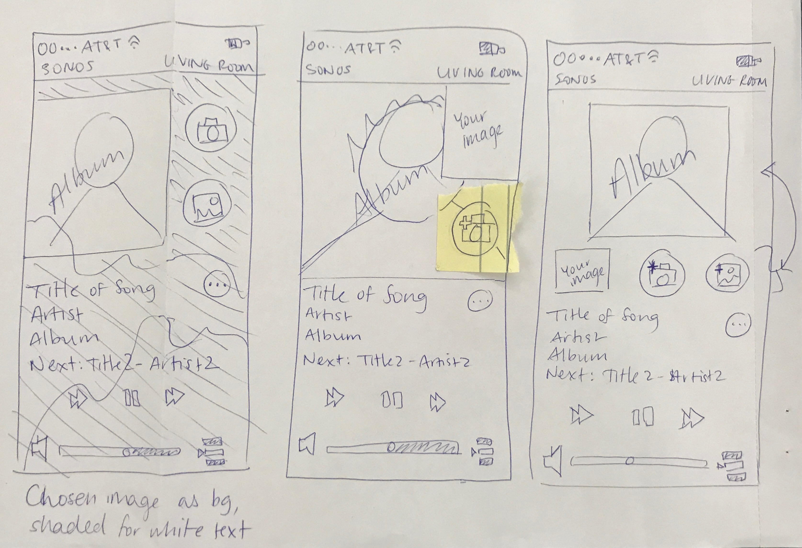
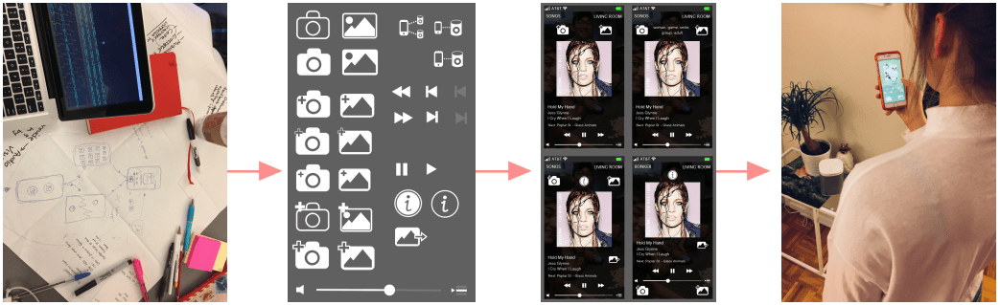
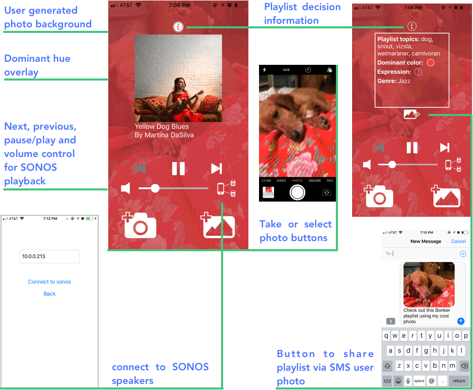
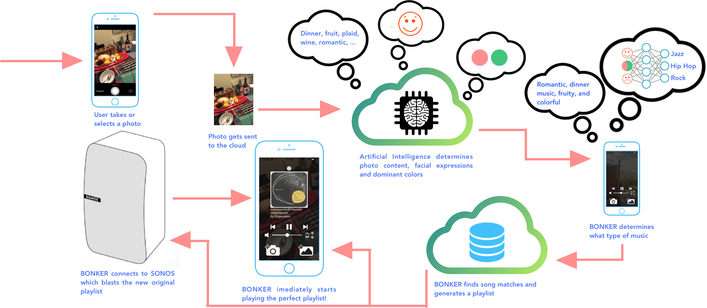

This project was the winner of the 2017 SONOS design challenge. My partner Ali Decker, an Engineering Psychology student, and I designed and developed a native app that uses computer vision and machine learning techniques to instantly curate a playlist from photos you snap.

When we asked our friends about their smart speaker and music-app experiences, a recurring pain point was that choosing or making a playlist took a long time, and was sometimes even stressful. This sounded like a barrier standing between listening to music and enjoying their lives.

Therefore, we planned to design an experience that instantly chooses the right music for the mood. Our aim was to relieve the user of the Paradox of Choice: the tendency for user anxiety to increase as the number of options increases, minimize time and clicks to music, and aid decision-making.

## Design process

The design process started with wireframes on paper which later became mockups in Illustrator. We conducted informal A-B testing to determine which icon designs fit user’s mental model for the intended function, and to ensure primary buttons were the most salient and reachable. Throughout the two weeks we also conducted informal experience testing that drove each iteration, and even led to new features.

## Design considerations

### Human-in-the-loop:

Music apps today use artificial intelligence to generate tailored playlists, but the user has no input. We wanted to engineer a system where the human is placed in-the-loop with AI by supplying the initial input, a photo. This relationship was designed to facilitate trust and collaboration in the playlist decisions.

### Explainable AI:

We didn’t want the decision making process behind music choices to be hidden from users, a black box. Instead, we designed the UI to facilitate transparency and observability into the decision making.

- This consideration lead to an "i" button that toggles the keywords, facial expressions, and color details from photos that inform BONKER’s music choice.
- We created a background overlay that reflects the dominant color in the image, to increase the perceived link between photo color and music mood. We also placed the user-generated photo behind this overlay to reinforce the connection between the photo contents and each music track.

## Development

I build the app using React Native, a JavaScript library for building native apps that are supported by both iOS and Android. I leveraged Expo’s React Native developer tools to build, test, and deploy prototype iterations. The AI is handled by several different Tensorflow convolutional neural network models I deployed on Google Cloud's ML engine: object detection, facial expression, and image properties, such as dominant color. Then, using a data-set generated by self-reported visual-auditory congruences I created a music-picking decision tree using the Iterative Dichotomiser 3(ID3) algorithm. Once a photo is taken and classified, the app searches and fetches matched tracks using SoundCloud’s API. Then, the generated playlist is streamed over wi-fi using the SONOS Control API giving the BONKER UI playback control.

<video controls>
  <source src="https://github.com/WoodburyShortridge/woodburyshortridge.github.io/blob/master/source/content/projects/2017-12-01/bonker-vid.mov?raw=true" type="video/mp4">
Your browser does not support the video tag.
</video>

The SONOS control API is not public yet, therefore the source code is private. If you have questions or would like to contribute, please feel free to [contact me](mailto:whshortridge@gmail.com).
